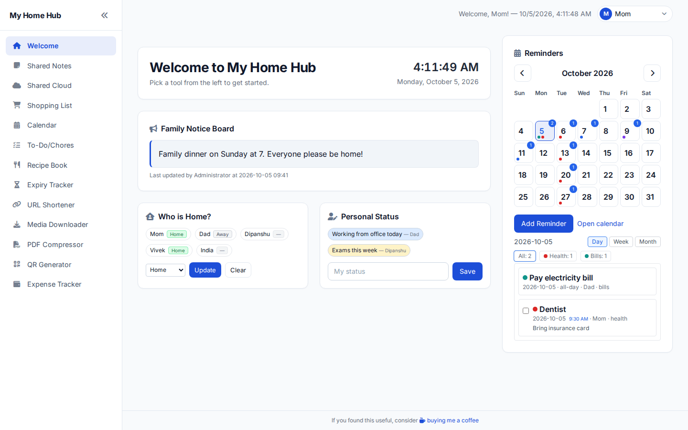

[](https://github.com/surajverma/homehub/actions/workflows/docker-publish.yml)

[](https://github.com/surajverma/homehub/commits/main)
[](https://github.com/surajverma/homehub/issues)
[](https://github.com/surajverma/homehub/issues?q=is%3Aissue+is%3Aclosed)
[](https://github.com/surajverma/homehub/issues?q=is%3Aissue+is%3Aopen+label%3A%22feature+request)
[](https://github.com/surajverma/homehub/stargazers)
[](https://github.com/surajverma/homehub/pkgs/container/homehub)

> **Maintainer Note**  
> Thank you for your interest in this project! I originally started it as a personal utility and never expected it to grow so quickly—I’m genuinely thrilled and grateful that it’s become helpful to you and your family.  
>  
> Please note that I am currently the sole maintainer and manage this repository alongside a full-time job, which means the time I can give to this project is somewhat limited. Responses to issues, pull requests, or questions may be delayed, especially during busy periods at work or at home.  
>  
> I typically work on the project after office hours or on weekends, depending on my availability and energy. Your patience, understanding, and support mean a lot—thank you for helping make this project better!


# 🏡 HomeHub: Your All-In-One Family Dashboard

Ever wanted a simple, private spot on your home network for your family's daily stuff? That's HomeHub. It's a lightweight, self-hosted web app that turns any computer (even a Raspberry Pi!) into a central hub for shared notes, shopping lists, chores, a media downloader, and even a family expense tracker.

It’s designed to be easy to use for everyone in the family, with a clean interface that works great on any device.

## What Can It Do?

HomeHub is packed with useful tools to make family life a little more organized:

* **📝 Shared Notes**: A simple place to jot down quick notes for everyone to see.
* **☁️ Shared Cloud**: Easily upload and share files across your home network.
* **🛒 Shopping List**: A collaborative list so you never forget the milk again. Comes with suggestions based on your history!
* **✅ Chore Tracker**: A simple to-do list for household tasks.
* **🗓️ Calendar & Reminders**: A shared calendar to keep track of important dates.
* **👋 Who's Home?**: See at a glance who is currently home.
* **💰 Expense Tracker**: A powerful tool to track family spending, with support for recurring bills like newspapers, milk, or subscriptions.
* **🎬 Media Downloader**: Save videos or music from popular sites directly to your server.
* ...and more, including a **Recipe Book**, **Expiry Tracker**, **URL Shortener**, **PDF Compressor**, **Weather Updates** and **QR Code Generator**!

## Salient Features
* **Private & Self-Hosted**: All your data stays on your network. No cloud, no tracking.
* **Simple & Lightweight**: Runs smoothly on minimal hardware.
* **Family-Focused**: Designed to be intuitive for users of all technical skill levels.
* **Customizable**: Toggle features on or off and even change the color theme right from the `config.yml` file.

<picture>
  <source media="(prefers-color-scheme: dark)" srcset="docs/images/homehub-dark.gif">
  
</picture>

## Getting Started is Easy

The best way to run HomeHub is with Docker. It's quick and keeps everything tidy

1. First, copy the `config-example.yml` to `config.yml`. This is where you'll name your hub and add family members. You can also set an optional password to protect the whole site. The shared calendar can be enabled with `feature_toggles.calendar`, and the weekly grid can start on the day configured under `reminders.calendar_start_day`.
<details>
  <summary>Click to see an example config.yml</summary>


```yaml
instance_name: "My Home Hub"
password: "" #leave blank for password less access
admin_name: "Administrator"
max_upload_mb: 1024 # largest upload in MB (Shared Cloud, PDFs); 0 removes the limit
language: en # UI language: en (English) or hi (Hindi)
feature_toggles:
  shopping_list: true
  media_downloader: true
  pdf_compressor: true
  qr_generator: true
  notes: true
  shared_cloud: true
  who_is_home: true
  personal_status: true
  chores: true
  recipes: true
  expiry_tracker: true
  url_shortener: false
  expense_tracker: true
  calendar: true

family_members:
  - Mom
  - Dad
  - Dipanshu
  - Vivek
  - India

reminders:
  # time_format controls how reminder times are displayed in the UI.
  # Allowed values: "12h" (default) or "24h". Remove or leave blank to fall back to 12h.
  time_format: 12h

  # calendar_start_day controls which day the reminders calendar starts on.
  # Accepts full weekday names (sunday, saturday).  
  calendar_start_day: monday #default is Sunday, comment this line to switch to default

  # Example reminder categories (keys lowercase no spaces recommended)
  categories:
    - key: health
      label: Health
      color: "#dc2626"
    - key: bills
      label: Bills
      color: "#0d9488"
    - key: school
      label: School
      color: "#7c3aed"
    - key: family
      label: Family
      color: "#2563eb"

#Optional settings
theme:
  primary_color: "#1d4ed8"
```

</details>

**2. Run with Docker Compose**

Use the provided `compose.yml` file to get started in seconds:

```yaml
# compose.yml
services:
  homehub:
    container_name: homehub
    image: ghcr.io/surajverma/homehub:latest
    restart: unless-stopped
    ports:
      - "5000:5000" #app listens internally on port 5000
    volumes:
      - ./uploads:/app/uploads
      - ./media:/app/media
      - ./pdfs:/app/pdfs
      - ./data:/app/data
      - ./config.yml:/app/config.yml:ro
    environment:
      - SECRET_KEY=${SECRET_KEY:-} # optional, from .env; left empty, a key is generated once and kept in data/secret_key
      # - TZ=Asia/Kolkata # optional; see "Timezone" below
```

```bash
docker compose up -d
```
That's it! Open your browser and head to [http://localhost:5000](http://localhost:5000)

## Admin password (optional)

By default anyone can pick the admin user from the user switcher. To protect it, the server owner can set an admin password from the host:

```bash
docker exec -it homehub flask set-admin-password
```

- You are asked to type the password twice. Only a salted hash is stored, in `data/app.db`; nothing is written to `config.yml`.
- Once set, switching to the admin user asks for the password. Family members keep switching freely.
- Run the same command again to change it. A forgotten password is fixed the same way.
- `docker exec -it homehub flask set-admin-password --clear` removes it and restores the default behaviour.
- Not using Docker? Run `flask set-admin-password` from the project folder.

The `password` in `config.yml` is separate: it protects the whole site and keeps working as before. You write it in `config.yml` as plain text; HomeHub only keeps a salted hash of it in memory, and after 5 wrong attempts the login form makes that device wait a minute, like the admin password prompt.

Logins and admin unlocks survive a restart: if `SECRET_KEY` is not set, HomeHub generates one on first start and keeps it in `data/secret_key`.

## Timezone (optional)

HomeHub decides what "today" is (due dates, overdue chores, recurring expenses and chores) and which time to show next to "By … at …" from the container's clock, which is UTC by default. If you are far from UTC, "today" can roll over a few hours early or late. Set your timezone with `TZ` in `compose.yml`:

```yaml
    environment:
      - TZ=Asia/Kolkata
```

Use a name from the [tz database](https://en.wikipedia.org/wiki/List_of_tz_database_time_zones), then run `docker compose up -d`. Leaving it out keeps the old UTC behaviour.

## Language

HomeHub can show its interface in another language. Set it for the whole household in `config.yml`:

```yaml
language: hi # en (English, default) or hi (Hindi)
```

The change applies on the next page load, no restart needed. A missing or unknown value falls back to English, and so does any text that has no translation yet. What you type into HomeHub (notes, chores, names) is never translated.

### Translating HomeHub

Each language is one file, `translations/<code>/LC_MESSAGES/messages.po`, covering both the pages and the page scripts. To add a language (Marathi, `mr`, as the example):

1. Create the file. This sets up the folder and the right plural rules for the language:
   ```bash
   pybabel init -i translations/messages.pot -d translations -l mr --no-wrap
   ```
2. Fill in each `msgstr` in `translations/mr/LC_MESSAGES/messages.po`. Any text editor works; [Poedit](https://poedit.net/) makes it easier. Keep placeholders such as `%(name)s` and `{count}` exactly as they are.
3. Set `language: mr` in `config.yml` and rebuild with `docker compose up -d --build`.

Good to know:
- Anything left untranslated shows in English, so a partial translation is welcome.
- Month and weekday names come from the language automatically.
- If the script is not covered by the Inter font (Tamil or Bengali, for example), add its Noto font to `LANGUAGE_FONTS` in `app/i18n.py`.
- Right-to-left languages are not supported yet: the text would translate, but the layout is not mirrored.
- Translations are built into the Docker image; the compiled `.mo` files are not kept in git.

Sending a translation: a pull request for a language should only change that language's file under `translations/` (plus, if needed, the font line and the language list in this README and `config-example.yml`). The tests check that placeholders are intact and that nothing like links or HTML has been added. A review from a second native speaker is very welcome.

<details>
  <summary>For developers: marking and updating text</summary>

In templates and Python, wrap text in `_()` (`ngettext()` for counts). Page scripts in `static/js` use `t('text', {params})`, `th()` when the result goes into an HTML string, `tn(one, other, count)` for counts and `tc('context', 'text')` when one English word needs different translations. A sentence with a name, number or link in it is always one string with a placeholder, so each language can put the value where its grammar needs it.

```bash
# After adding or changing text: collect the strings and bring every language file up to date
flask translations update
# Compile for a local (non-Docker) run
flask translations compile
```

</details>

## Theming

HomeHub follows your system dark/light mode. You can customize colors via `config.yml > theme`.

Configurable keys (all optional):

```yaml
theme:
  # Accent colors
  primary_color: "#1d4ed8"
  secondary_color: "#a0aec0"
  # Surfaces & text
  background_color: "#f8fafc"
  card_background_color: "#ffffff"
  text_color: "#0f172a"
  # Sidebar palette. Leave these out for the default light sidebar.
  # Setting sidebar_background_color gives a coloured sidebar with light links.
  sidebar_background_color: "#2563eb"
  sidebar_text_color: "#ffffff"                # text color used for the sidebar title and labels
  sidebar_link_color: "rgba(255,255,255,0.95)" # link text color in sidebar items
  sidebar_link_border_color: "rgba(255,255,255,0.18)" # subtle border around sidebar links
  sidebar_active_color: "#3b82f6"              # background of the current page's link
```

Tips:
- The old default blue sidebar (`#2563eb`) is treated as "not set", so configs copied from an older `config-example.yml` get the new light sidebar. Pick any other colour to keep a coloured sidebar.
- Prefer lighter/darker accents? Tweak `primary_color` and `secondary_color`.
- Dark mode palette adapts automatically; the variables above apply to light mode, while dark mode uses tuned counterparts for good contrast.

## Weather Widget

HomeHub includes an optional weather widget powered by [Open-Meteo](https://open-meteo.com/), a free weather API. The widget displays current weather conditions and optionally today's forecast on your dashboard.

**By default, the weather widget is hidden.** You can enable it through `config.yml`:

```yaml
weather:
  enabled: true # set to true to show the widget
  label: "" # optional location label (e.g., "Kolkata"). Leave blank to hide.
  latitude: "" # optional, leave empty to use browser geolocation
  longitude: "" # optional, leave empty to use browser geolocation
  timezone: "" # optional, e.g., "Asia/Kolkata" or "America/New_York"; if unset, API uses timezone=auto
  units: metric # metric or imperial (default: metric)
  view: compact # compact or detailed (detailed shows today's forecast: sunrise, sunset, UV, rain %, highs/lows)
```

**Features:**
- **Two view modes:**
  - `compact`: Shows current temperature, weather condition, feels like, wind (with direction and gusts), humidity, and recent precipitation
  - `detailed`: Adds today's forecast with sunrise/sunset times, UV index, precipitation probability, and daily high/low temperatures
- **Smart caching:** Weather data is cached for 15 minutes to respect API rate limits and improve performance
- **Flexible location:** Use configured coordinates or browser geolocation
- **Timezone support:** Displays times in your configured timezone, or uses automatic detection
- **Unit selection:** Choose between metric (°C, km/h, mm) or imperial (°F, mph, mm) units

**Privacy Note:** When enabled, the widget makes API requests to Open-Meteo's servers. Please review [Open-Meteo's privacy policy](https://open-meteo.com/en/terms) for details on their data handling practices.

## Development Setup

To contribute or run & build HomeHub locally, follow these steps:

### 1. Clone the Repository
```bash
git clone https://github.com/surajverma/homehub.git
cd homehub
```

### 2. Python Environment Setup
```bash
python -m venv venv
venv\Scripts\activate  # On Windows
pip install -r requirements-dev.txt  # the app's packages plus pytest
```

### 3. Configuration
- Copy `config-example.yml` to `config.yml` and edit as needed for your family, features, and theme.

### 4. CSS Build (Tailwind + Custom Styles)
```bash
npm install
npm run build:css
```
- For live CSS rebuilds during development:
```bash
npm run watch:css
```

### 5. Running the App
- **With Docker (recommended):**
  ```bash
  docker compose up -d
  ```
- **Locally (for development):**
  ```bash
  python run.py
  ```
  (Ensure you have built CSS and set up your config.)

### 6. Troubleshooting
- If you see missing dependency errors, ensure you have run both `pip install -r requirements-dev.txt` and `npm install`.
- If port 5000 is in use, stop the conflicting service or change the port in `compose.yml` and `config.yml`.
- For Docker issues, try `docker compose down` then `docker compose up -d`.
- If the log says `config.yml is missing` or `config.yml is a folder`, HomeHub is running on the defaults from `config-example.yml`. Docker creates an empty `config.yml` folder when the file is not there at first start: remove that folder, copy `config-example.yml` to `config.yml`, and start the container again.
- `docker ps` shows the container as `healthy` once the app answers on `/healthz`.
- The database runs in SQLite's WAL mode. If `data/` sits on a network share (NFS, SMB) and you see `database is locked` or disk I/O errors, add `- SQLITE_JOURNAL_MODE=DELETE` under `environment:` to go back to the previous mode.

### Supported platforms
The Docker image is built for `linux/amd64` and `linux/arm64`, which includes a Raspberry Pi 4 or 5 running a 64-bit OS. 32-bit ARM (`linux/arm/v7`, e.g. 32-bit Raspberry Pi OS) is no longer built: stay on the last image you pulled, or move to a 64-bit OS to keep getting updates.


## License

This project is licensed under the MIT License. See the [LICENSE](LICENSE) file for details.

## Contributing

Contributions are always welcome! If you have any ideas, suggestions, or bug reports, please open an issue or submit a pull request.

## Disclaimer & Security Notice

This software is being provided to the community "as is." This means it comes **without any warranty or guarantee of any kind.** While I've done my best to build it, I can't promise it will be perfect, fit your exact needs, or be 100% free of bugs.

**Please be aware that you are using this software at your own risk.** The authors and contributors are not responsible for any problems, damages, or data loss that might occur from using it.

### 🛡️ Important Security Notice

This project is built for use on a **local or trusted network** (like your home).

It is **not designed or hardened to be safely exposed to the public internet.** If you choose to host this software publicly, you are solely responsible for performing a full security review and adding the necessary protections before you do so.

### 🌤️ Weather Data & Third-Party Services

The optional weather widget uses [Open-Meteo](https://open-meteo.com/), a free weather API service. When the weather widget is enabled:
- Your browser makes requests to Open-Meteo's servers to fetch weather data
- Location coordinates (latitude/longitude) are sent to their API
- Open-Meteo has its own [privacy policy](https://open-meteo.com/en/terms) and terms of service

By enabling the weather widget, you acknowledge that weather data is provided by a third-party service and is subject to their policies. HomeHub itself does not store or process weather data beyond local browser caching.

## Have Fun!

This project was built to be a practical tool for my own family, and I hope it's useful for yours too.

If you find HomeHub useful, you can [buy me a coffee ☕](https://ko-fi.com/skv).
